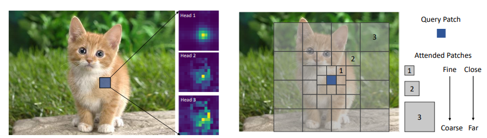

# Focal Transformer \[NeurIPS 2021 Spotlight\]

This is the official implementation of our [Focal Transformer -- "Focal Self-attention for Local-Global Interactions in Vision Transformers"](https://arxiv.org/pdf/2107.00641.pdf), 
by Jianwei Yang, Chunyuan Li, Pengchuan Zhang, Xiyang Dai, Bin Xiao, Lu Yuan and Jianfeng Gao.

## Introduction

Our Focal Transfomer introduced a new self-attention mechanism called **focal self-attention** for vision transformers. 
In this new mechanism, **each token attends the closest surrounding tokens at fine granularity but the tokens far away at coarse granularity**, 
and thus can capture both short- and long-range visual dependencies efficiently and effectively. 

With our Focal Transformers, we achieved superior performance over the state-of-the-art vision Transformers on a range of public benchmarks. 
In particular, our Focal Transformer models with a moderate size of 51.1M and a larger size of 89.8M achieve `83.6 and 84.0` Top-1 accuracy, respectively, 
on ImageNet classification at 224x224 resolution. 
Using Focal Transformers as the backbones, we obtain consistent and substantial improvements over the current state-of-the-art methods 
for 6 different object detection methods trained with standard 1x and 3x schedules. 
Our largest Focal Transformer yields `58.7/58.9 box mAPs` and `50.9/51.3 mask mAPs` on COCO mini-val/test-dev, 
and `55.4 mIoU` on ADE20K for semantic segmentation.

:film_strip: [Video by The AI Epiphany](https://www.google.com/url?sa=t&rct=j&q=&esrc=s&source=web&cd=&cad=rja&uact=8&ved=2ahUKEwjzk6Wm8NHyAhVCqlsKHYepD9wQtwJ6BAgDEAM&url=https%3A%2F%2Fwww.youtube.com%2Fwatch%3Fv%3DYH319yyeoVw&usg=AOvVaw27s7EE-txctmc6_BwKnnfE)

## Faster Focal Transformer

As you may notice, though the theoritical GFLOPs of our Focal Transformer is comparable to prior works, its wall-clock efficiency lags behind. Therefore, we are releasing a faster version of Focal Transformer, which discard all the rolling and unfolding operations used in our first version.

| Model | Pretrain | Use Conv | Resolution | acc@1 | acc@5 | #params | FLOPs | Throughput (imgs/s) | Checkpoint | Config |
| :---: | :---: | :---: | :---: | :---: | :---: | :---: | :---: |:---: | :---: | :---: |
| Focal-T | IN-1K | No | 224 | 82.2 | 95.9 | 28.9M   | 4.9G   | 319 | [download](https://projects4jw.blob.core.windows.net/model/focal-transformer/imagenet1k/focal-tiny-is224-ws7.pth) | [yaml](configs/focal_tiny_patch4_window7_224.yaml) |
| Focal-fast-T | IN-1K | Yes  | 224 | 82.4 | 96.0 | 30.2M   | 5.0G   | 483 | [download](https://projects4jw.blob.core.windows.net/model/focal-transformer/imagenet1k/focalv2-tiny-useconv-is224-ws7.pth) | [yaml](configs/focalv2_tiny_useconv_patch4_window7_224.yaml) |
| Focal-S | IN-1K | No | 224 | 83.6 | 96.2 | 51.1M   | 9.4G   | 192 | [download](https://projects4jw.blob.core.windows.net/model/focal-transformer/imagenet1k/focal-small-is224-ws7.pth) |[yaml](configs/focal_small_patch4_window7_224.yaml) |
| Focal-fast-S | IN-1K | Yes | 224 | 83.6 | 96.4 | 51.5M   | 9.4G  | 293  | [download](https://projects4jw.blob.core.windows.net/model/focal-transformer/imagenet1k/focalv2-small-useconv-is224-ws7.pth) |[yaml](configs/focalv2_small_useconv_patch4_window7_224.yaml) |
| Focal-B | IN-1K | No | 224 | 84.0 | 96.5 | 89.8M   | 16.4G  | 138 | [download](https://projects4jw.blob.core.windows.net/model/focal-transformer/imagenet1k/focal-base-is224-ws7.pth) | [yaml](configs/focal_base_patch4_window7_224.yaml) |
| Focal-fast-B | IN-1K | Yes | 224 | 84.0 | 96.6 | 91.2M   | 16.4G  | 203 | [download](https://projects4jw.blob.core.windows.net/model/focal-transformer/imagenet1k/focalv2-base-useconv-is224-ws7.pth) | [yaml](configs/focalv2_base_useconv_patch4_window7_224.yaml) |

## Benchmarking 

### Image Classification Throughput with Image Resolution

| Model | Top-1 Acc. | GLOPs (224x224) | 224x224 | 448x448 | 896 x 896  |
| :---: | :---: | :---: | :---: | :---: | :---: |
DeiT-Small/16 | 79.8 | 4.6 | 939 | 101 | 20
PVT-Small	| 79.8	| 3.8	| 794	| 172	| 31 |
CvT-13	   | 81.6	| 4.5	| 746	| 125	| 14 |
ViL-Small  | 82.0	| 5.1	| 397	| 87	| 17 |
Swin-Tiny	| 81.2	| 4.5	| 760	| 189	| 48 |
Focal-Tiny	| 82.2	| 4.9	| 319	| 105	| 27 |
PVT-Medium	| 81.2	| 6.7	| 517	| 111	| 20 |
CvT-21	| 82.5	| 7.1	| 480	| 85	|  10 |
ViL-Medium	| 83.3	| 9.1	| 251	| 53	| 8 |
Swin-Small	| 83.1	| 8.7	| 435	| 111	| 28 |
Focal-Small	| 83.6	| 9.4	| 192	| 63	| 17 |
ViT-Base/16	| 77.9	| 17.6	| 291	| 57	| 8 |
Deit-Base/16 | 81.8	| 17.6	| 291	| 57	| 8 |
PVT-Large	| 81.7	| 9.8	| 352	| 77	| 14 |
ViL-Base	| 83.2	| 13.4	| 145	| 35	| 5 |
Swin-Base	| 83.4	| 15.4	| 291	| 70	| 17|
Focal-Base	| 84.0	| 16.4	| 138	| 44	| 11|

### Image Classification on [ImageNet-1K](https://www.image-net.org/)

| Model | Pretrain | Use Conv | Resolution | acc@1 | acc@5 | #params | FLOPs | Checkpoint | Config |
| :---: | :---: | :---: | :---: | :---: | :---: | :---: | :---: |:---: | :---: |
| Focal-T | IN-1K | No | 224 | 82.2 | 95.9 | 28.9M   | 4.9G   | [download](https://projects4jw.blob.core.windows.net/model/focal-transformer/imagenet1k/focal-tiny-is224-ws7.pth) | [yaml](configs/focal_tiny_patch4_window7_224.yaml) |
| Focal-T | IN-1K | Yes  | 224 | 82.7 | 96.1 | 30.8M   | 5.2G   | [download](https://projects4jw.blob.core.windows.net/model/focal-transformer/imagenet1k/focal-tiny-useconv-is224-ws7.pth) | [yaml](configs/focal_tiny_useconv_patch4_window7_224.yaml) |
| Focal-S | IN-1K | No | 224 | 83.6 | 96.2 | 51.1M   | 9.4G   | [download](https://projects4jw.blob.core.windows.net/model/focal-transformer/imagenet1k/focal-small-is224-ws7.pth) |[yaml](configs/focal_small_patch4_window7_224.yaml) |
| Focal-S | IN-1K | Yes | 224 | 83.8 | 96.5 | 53.1M   | 9.7G   | [download](https://projects4jw.blob.core.windows.net/model/focal-transformer/imagenet1k/focal-small-useconv-is224-ws7.pth) |[yaml](configs/focal_small_useconv_patch4_window7_224.yaml) |
| Focal-B | IN-1K | No | 224 | 84.0 | 96.5 | 89.8M   | 16.4G  | [download](https://projects4jw.blob.core.windows.net/model/focal-transformer/imagenet1k/focal-base-is224-ws7.pth) | [yaml](configs/focal_base_patch4_window7_224.yaml) |
| Focal-B | IN-1K | Yes | 224 | 84.2 | 97.1 | 93.3M   | 16.8G  | [download](https://projects4jw.blob.core.windows.net/model/focal-transformer/imagenet1k/focal-base-useconv-is224-ws7.pth) | [yaml](configs/focal_base_useconv_patch4_window7_224.yaml) |

### Object Detection and Instance Segmentation on [COCO](https://cocodataset.org/#home)

#### [Mask R-CNN](https://openaccess.thecvf.com/content_ICCV_2017/papers/He_Mask_R-CNN_ICCV_2017_paper.pdf)

| Backbone | Pretrain | Lr Schd | #params | FLOPs | box mAP | mask mAP | 
| :---: | :---: | :---: | :---: | :---: | :---: | :---: |
| Focal-T | ImageNet-1K | 1x | 49M | 291G | 44.8 | 41.0 | 
| Focal-T | ImageNet-1K | 3x | 49M | 291G | 47.2 | 42.7 | 
| Focal-S | ImageNet-1K | 1x | 71M | 401G | 47.4 | 42.8 | 
| Focal-S | ImageNet-1K | 3x | 71M | 401G | 48.8 | 43.8 | 
| Focal-B | ImageNet-1K | 1x | 110M | 533G | 47.8 | 43.2 | 
| Focal-B | ImageNet-1K | 3x | 110M | 533G | 49.0 | 43.7 | 

#### [RetinaNet](https://openaccess.thecvf.com/content_ICCV_2017/papers/Lin_Focal_Loss_for_ICCV_2017_paper.pdf)

| Backbone | Pretrain | Lr Schd | #params | FLOPs | box mAP | 
| :---: | :---: | :---: | :---: | :---: | :---: |
| Focal-T | ImageNet-1K | 1x | 39M | 265G | 43.7 |
| Focal-T | ImageNet-1K | 3x | 39M | 265G | 45.5 | 
| Focal-S | ImageNet-1K | 1x | 62M | 367G | 45.6 | 
| Focal-S | ImageNet-1K | 3x | 62M | 367G | 47.3 | 
| Focal-B | ImageNet-1K | 1x | 101M | 514G | 46.3 | 
| Focal-B | ImageNet-1K | 3x | 101M | 514G | 46.9 | 

#### Other detection methods

| Backbone | Pretrain | Method | Lr Schd | #params | FLOPs | box mAP | 
| :---: | :---: | :---: | :---: | :---: | :---: | :---: |
| Focal-T | ImageNet-1K | [Cascade Mask R-CNN](https://arxiv.org/abs/1712.00726) | 3x | 87M  | 770G | 51.5 | 
| Focal-T | ImageNet-1K | [ATSS](https://arxiv.org/pdf/1912.02424.pdf)           | 3x | 37M  | 239G | 49.5 |
| Focal-T | ImageNet-1K | [RepPointsV2](https://arxiv.org/pdf/2007.08508.pdf)    | 3x | 45M  | 491G | 51.2 | 
| Focal-T | ImageNet-1K | [Sparse R-CNN](https://arxiv.org/pdf/2011.12450.pdf)   | 3x | 111M | 196G | 49.0 | 

### Semantic Segmentation on [ADE20K](https://groups.csail.mit.edu/vision/datasets/ADE20K/)

| Backbone | Pretrain  | Method | Resolution | Iters | #params | FLOPs | mIoU | mIoU (MS) | 
| :---: | :---: | :---: | :---: | :---: | :---: | :---: | :---: | :---: |
| Focal-T | ImageNet-1K  | [UPerNet](https://arxiv.org/pdf/1807.10221.pdf) | 512x512 | 160k | 62M  | 998G | 45.8 | 47.0 | 
| Focal-S | ImageNet-1K  | [UPerNet](https://arxiv.org/pdf/1807.10221.pdf) | 512x512 | 160k | 85M | 1130G | 48.0 | 50.0 | 
| Focal-B | ImageNet-1K  | [UPerNet](https://arxiv.org/pdf/1807.10221.pdf) | 512x512 | 160k | 126M | 1354G | 49.0 | 50.5 | 
| Focal-L | ImageNet-22K | [UPerNet](https://arxiv.org/pdf/1807.10221.pdf) | 640x640 | 160k | 240M | 3376G | 54.0 | 55.4 | 

## Getting Started

* Please follow [get_started_for_image_classification.md](./classification/get_started.md) to get started for image classification.
* Please follow [get_started_for_object_detection.md](./detection/get_started.md) to get started for object detection.
* Please follow [get_started_for_semantic_segmentation.md](./segmentation/get_started.md) to get started for semantic segmentation.

## Citation

If you find this repo useful to your project, please consider to cite it with following bib:

    @misc{yang2021focal,
        title={Focal Self-attention for Local-Global Interactions in Vision Transformers}, 
        author={Jianwei Yang and Chunyuan Li and Pengchuan Zhang and Xiyang Dai and Bin Xiao and Lu Yuan and Jianfeng Gao},
        year={2021},
        eprint={2107.00641},
        archivePrefix={arXiv},
        primaryClass={cs.CV}
    }

## Acknowledgement

Our codebase is built based on [Swin-Transformer](https://github.com/microsoft/Swin-Transformer). We thank the authors for the nicely organized code!

## Contributing

This project welcomes contributions and suggestions.  Most contributions require you to agree to a
Contributor License Agreement (CLA) declaring that you have the right to, and actually do, grant us
the rights to use your contribution. For details, visit https://cla.opensource.microsoft.com.

When you submit a pull request, a CLA bot will automatically determine whether you need to provide
a CLA and decorate the PR appropriately (e.g., status check, comment). Simply follow the instructions
provided by the bot. You will only need to do this once across all repos using our CLA.

This project has adopted the [Microsoft Open Source Code of Conduct](https://opensource.microsoft.com/codeofconduct/).
For more information see the [Code of Conduct FAQ](https://opensource.microsoft.com/codeofconduct/faq/) or
contact [opencode@microsoft.com](mailto:opencode@microsoft.com) with any additional questions or comments.

## Trademarks

This project may contain trademarks or logos for projects, products, or services. Authorized use of Microsoft 
trademarks or logos is subject to and must follow 
[Microsoft's Trademark & Brand Guidelines](https://www.microsoft.com/en-us/legal/intellectualproperty/trademarks/usage/general).
Use of Microsoft trademarks or logos in modified versions of this project must not cause confusion or imply Microsoft sponsorship.
Any use of third-party trademarks or logos are subject to those third-party's policies.
